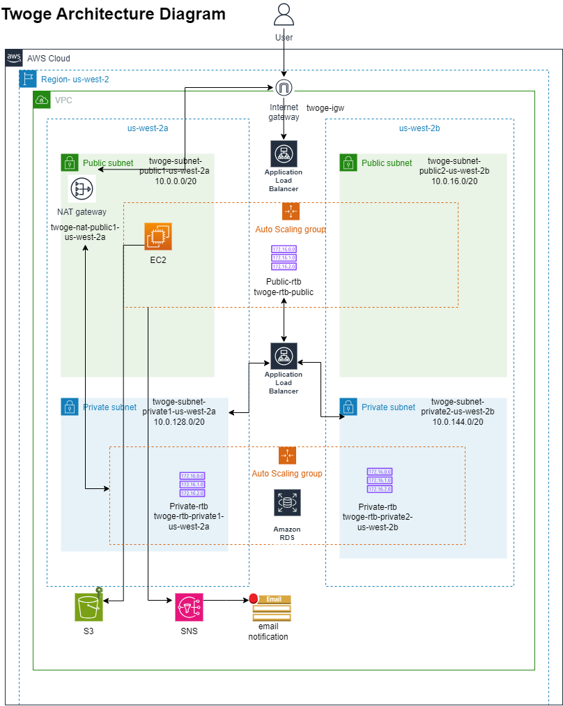

# Twoge

Welcome to the official repository for Twoge, a niche social media platform dedicated to Doge, envisioned by Elon Musk. As a team member of Codeplatoon, this README serves as your guide to deploying and maintaining the Twoge application on AWS.

## About Twoge

Twoge is a unique platform exclusively for sharing and enjoying content about Doge. With Twoge, users can post, interact, and celebrate everything related to their favorite automobile brand, Doge. The platform aims to connect Doge enthusiasts worldwide and be the central hub for Doge discourse.

## Deployment Overview

This project uses various AWS services for a robust and scalable deployment. Below is a summary of the services and their role in Twoge:

- **AWS EC2**: Hosts the Twoge application servers.
- **AWS S3**: Stores static assets like images and videos.
- **AWS IAM**: Manages permissions and access to AWS resources.
- **AWS VPC**: Provides a secure, isolated network for Twoge.
- **AWS ALB**: Balances traffic across EC2 instances.
- **AWS ASG**: Manages scaling of EC2 instances based on demand.
- **AWS SNS**: Sends notifications regarding the application's health.
- **AWS RDS**: Optionally, hosts the database in a more secure setup.


## Table of Contents

- [Step-By-Step Instruction Guide](#step-by-step-instruction-guide)


## Step-By-Step Instruction Guide
### 1. Create a VPC with two public subnets and private subnets.
* Open the Amazon VPC console 
* In the **VPC Dashboard**, choose **Create VPC**.
* Under **VPC settings**, choose **VPC and more**.
* Complete these fields as follows:
   - The IPv4 CIDR block should be ```10.0.0.0/16```.
   - Keep No IPv6 CIDR block option selected.
   - The Tenancy should remain Default.
   - Select 2 for the Number of Availability Zones (AZs).
   - Select 2 for the Number of public subnets and private subnets.
* Choose **Create VPC**. It takes several minutes for the VPC to be created.
  
###


## Appendix



